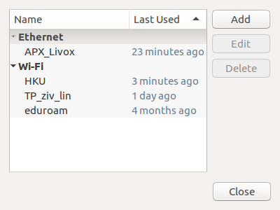
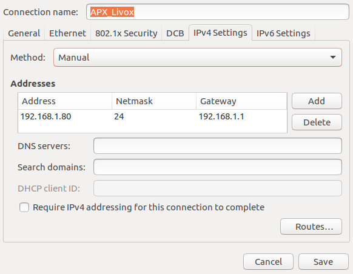

# livox_lidar_setup

## LiDAR Preparation

Follow the [instructions](https://www.livoxtech.com/3296f540ecf5458a8829e01cf429798e/downloads/Livox%20Mid%20Series%20User%20Manual%20EN%2020190118.pdf) on `page 13` to setup the static ip address of livox LiDAR. Remeber to connect both your PC and Livox LiDAR to the same router and use Livox viewer to configure.

## Livox Driver Setup

Install [Livox-SDK](https://github.com/Livox-SDK/Livox-SDK) and clone [livox_ros_driver](https://github.com/Livox-SDK/livox_ros_driver) on your Linux computer. Complie the `livox_ros_driver` package as suggested. Please remember to modify the parameter `bd_list` in launch file.

## Linux Network Setup

You need to disenable Wi-Fi first and edit the corresponding wired connection.

Change the `IPv4 Settings` as shown below and save. Please notice the `192.168.1.80` is the static ip address of your computer, which has to be different with the LiDAR!

## Ready to go

You could check your connection with [Livox Viewer](https://www.livoxtech.com/downloads). Connect your LiDAR and click play button to see if any data is broadcasting. Then roslaunch and enjoy!
